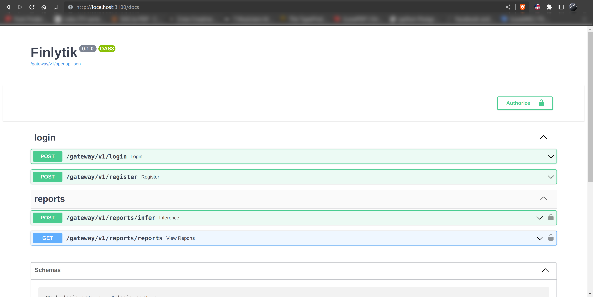
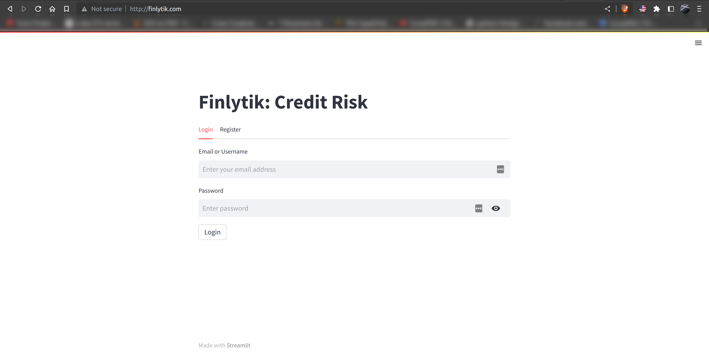
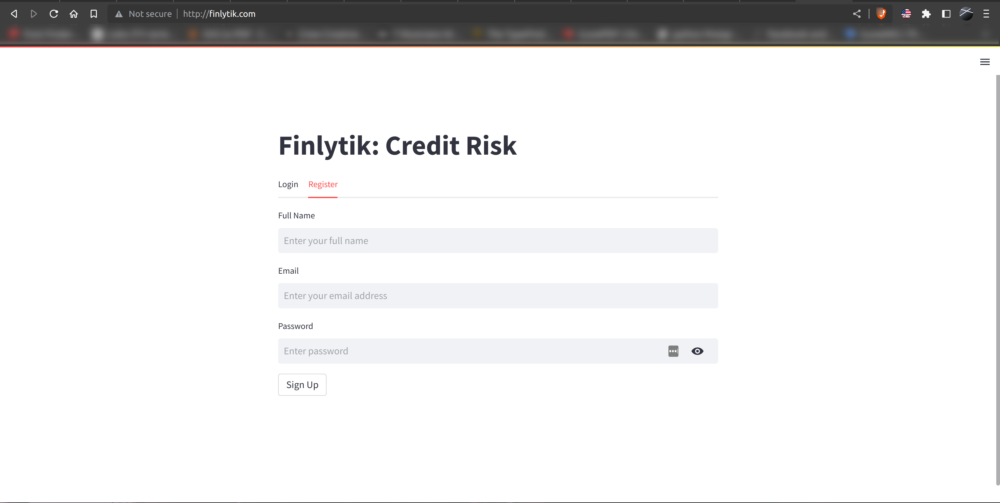
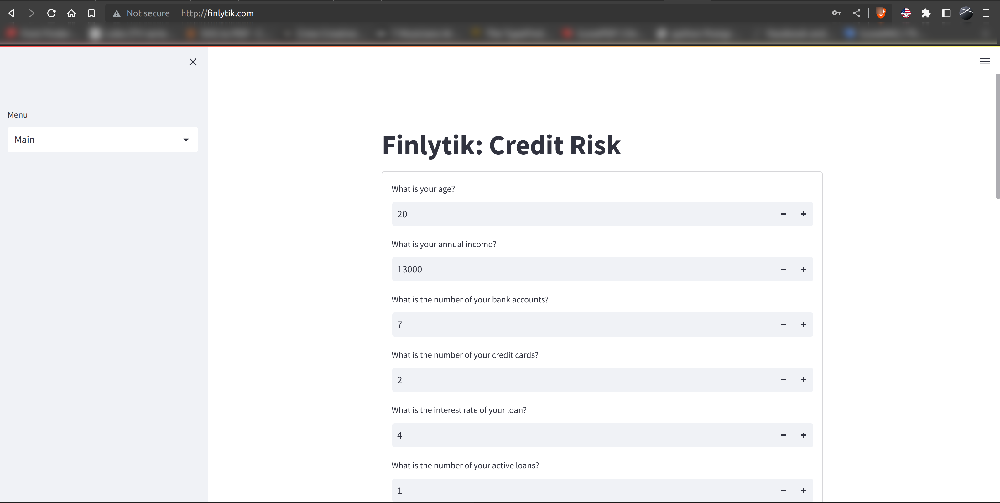
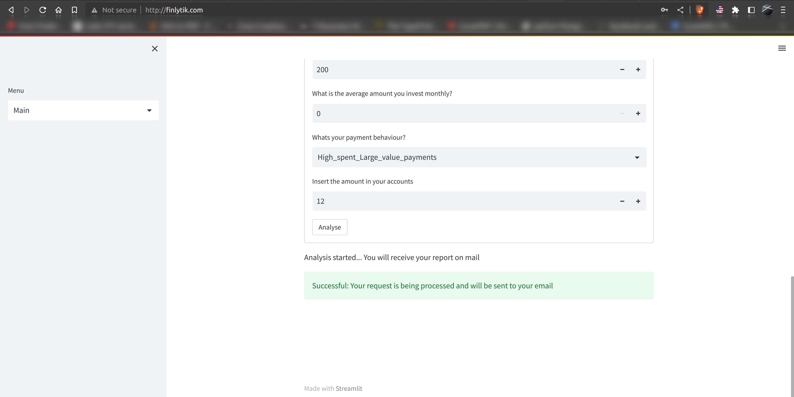
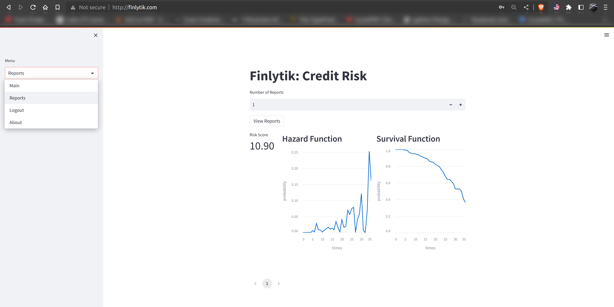
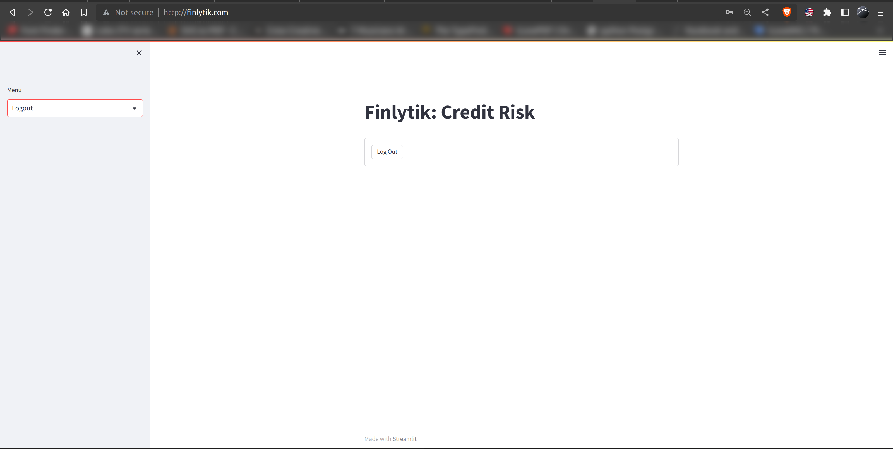

# finSurvival
Credit Survival Analysis: Full stack, credit risk application using FastAPI for backend service, PostgreSQL as database, Docker &amp; Kubernetes for orchestration, RabbitMQ for messaging, PySurvival, MLFlow for the training environment, Streamlit for Frontend (API consuming).

### Interactive API documentation: Exposed Endpoints 

[](https://github.com/realonbebeto/finSurvival)


### Streamlit Frontend: Login

[](https://github.com/realonbebeto/finSurvival)


### Streamlit Frontend: Registration/Sign Up

[](https://github.com/realonbebeto/finSurvival)


### Streamlit Frontend: Details Submission

[](https://github.com/realonbebeto/finSurvival)


### Streamlit Frontend: Details Submission Info

[](https://github.com/realonbebeto/finSurvival)


### Streamlit Frontend: Report View & Menu

[](https://github.com/realonbebeto/finSurvival)

### Streamlit Frontend: Logout

[](https://github.com/realonbebeto/finSurvival)


## Features
* Full **Docker** integration (Docker based).
* **Kubernetes** Microservices.
* Python <a href="https://github.com/tiangolo/fastapi" class="external-link" target="_blank">**FastAPI**</a> backends.
* **Streamlit** Frontend
* **RabbitMQ** Messaging Queue
* **PostgreSQL** Database
* **MLFlow**
* **pySurvival**
## How to Run the Project Locally (Minikube)
### Prerequisites
* minikube installed

### Steps
1. Adjust the auth k8s manifest assign appropriate first superuser email, corresponding password and postgres password. Apply the same to other manifests that require them.
   
2. Create a postgres database named **finlytik**. For local use I recommend a postgres docker instance using <a href="https://github.com/realonbebeto/finSurvival/tree/main/recipes/docker-postgres" class="external-link" target="_blank">**Postgres recipe**</a> with IP adjustments to your suit. Run with the default or your choosing of POSTGRES_PASSWORD, FIRST_SUPERUSER_PASSWORD
   
3. Start minikube by running the following command:
    ```
    minikube start
    ```

4. Enable ingress in minikube installation by running the following command:
    ```
    minikube addons enable ingress
    ```

5. Set your `/etc/hosts` file with the following:
    cluster-ip      finlytik.com
    cluster-ip      rabbitmq-manager.com

    Get the `cluster-ip` by running the following command:
    ```
    minikube ip
    ```

6. Run the rabbitmq k8s manifests by running the following command from the folder:
    ```
    kubectl apply -f .
    ```

7. Go to rabbitmq-manager.com from your browser and login using `guest` for both the username and password. Create queues named `profile` and `detail` on RabbitMQ fro the Queues tab.

8. Run the other services by running the following command from the respective manifest folders:
    ```
    kubectl apply -f .
    ```
9. Go to finlytik.com from your browser and explore the application.
   